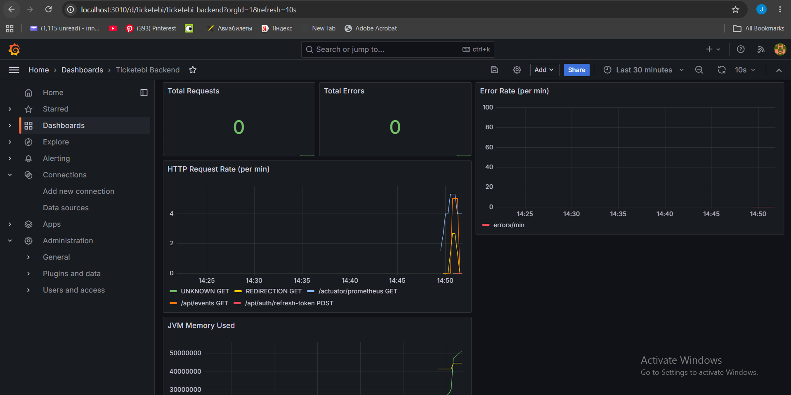
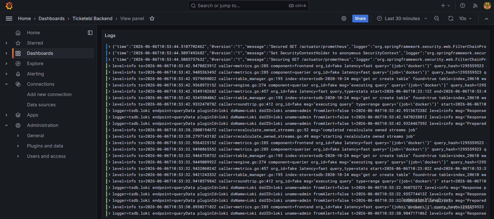
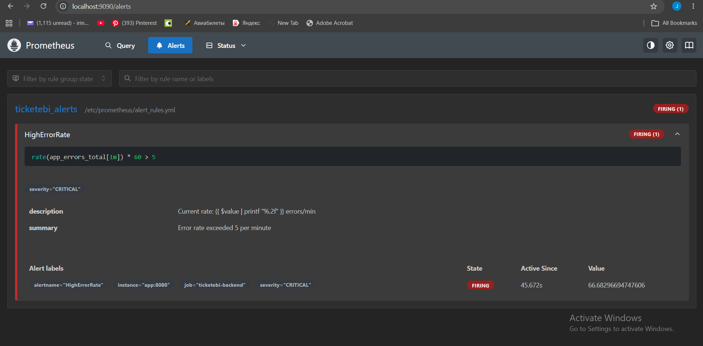

# Ticketebi — Ticket Selling Platform

Spring Boot backend + React frontend with a full observability stack.

# Observability Lab

## Architecture

```
Spring Boot App (:8080)
  │
  ├─ /actuator/prometheus ──scrape──► Prometheus (:9090) ──► Grafana (:3010)
  │                                        │                      ▲
  │                                   alert_rules.yml             │
  │                                                               │
  └─ stdout (JSON logs) ──► Promtail ──► Loki (:3100) ───────────┘
```

Data flow:
- **Prometheus** scrapes `/actuator/prometheus` every 15 seconds and evaluates alert rules.
- **Promtail** tails Docker container stdout, parses the JSON log lines, and ships them to **Loki**.
- **Grafana** queries both Prometheus (metrics) and Loki (logs) and displays them on a single dashboard.

## Running the stack

```bash
docker compose up --build
```

| Service    | URL                         |
|------------|-----------------------------|
| App        | http://localhost:8080       |
| Prometheus | http://localhost:9090       |
| Grafana    | http://localhost:3010       |
| Loki       | http://localhost:3100/ready |

Grafana login: `admin` / `admin`

## Triggering the CRITICAL alert

The alert fires when `app_errors_total` exceeds **5 errors per minute**.

Spam the forced-error endpoint:

```bash
# Windows PowerShell
for ($i=0; $i -lt 50; $i++) { curl http://localhost:8080/api/status/error; Start-Sleep -Milliseconds 100 }

# Linux / macOS
for i in $(seq 1 50); do curl -s http://localhost:8080/api/status/error > /dev/null; sleep 0.1; done
```

Then open Prometheus → **Alerts** tab, or Grafana → **Alerting** → **Alert rules** to see the `HighErrorRate` alert switch to FIRING.

## Logging strategy

Logs are written to stdout in JSON format using `logstash-logback-encoder`. Each line is a self-contained JSON object with fields: `time`, `level`, `message`, `logger`. This is activated by the `prod` Spring profile (`SPRING_PROFILES_ACTIVE=prod` in docker-compose.yml). In local development, the default profile uses plain-text console output.

Promtail reads Docker container log files from `/var/lib/docker/containers/`, unwraps Docker's outer JSON envelope, and parses the inner application JSON to extract `level` as a Loki label for filtering.

## Evidence

### Grafana Dashboard


### Loki Logs


### Prometheus Alert Firing


## Analysis

**Why is JSON-structured logging more efficient than plain text?**

Plain-text logs require fragile regex parsing to extract fields like log level or request ID. JSON logs are machine-readable by default — Loki, Elasticsearch, and any log aggregator can index individual fields without parsing heuristics. This makes filtering (`level = "ERROR"`), alerting on log content, and correlating logs with traces dramatically faster and more reliable.

**Fundamental difference between Prometheus and Loki**

Prometheus is a **time-series metrics database**. It stores numeric samples (counters, gauges, histograms) indexed by metric name and label set, and evaluates algebraic expressions over those samples (e.g. `rate(app_errors_total[1m])`). Loki is a **log aggregation system**. It stores raw log lines indexed only by label metadata (not full-text), and retrieves them by label filter or substring search (LogQL). Prometheus answers "how many errors per minute"; Loki answers "show me the actual error messages".

**Handling 6-month log retention without disk exhaustion**

Three levers:

1. **Loki retention config** — set `retention_period: 4320h` (180 days) in Loki's `local-config.yaml` so logs are automatically deleted after 6 months.
2. **Log shipping to object storage** — configure Loki to use S3 or GCS as its chunk store instead of local disk. Object storage is ~20× cheaper per GB than SSD and scales without manual intervention.
3. **Log sampling / filtering at Promtail** — use Promtail pipeline `drop` stages to discard high-volume DEBUG and INFO lines in production, keeping only WARN and ERROR. This alone can reduce volume by 80–90%.